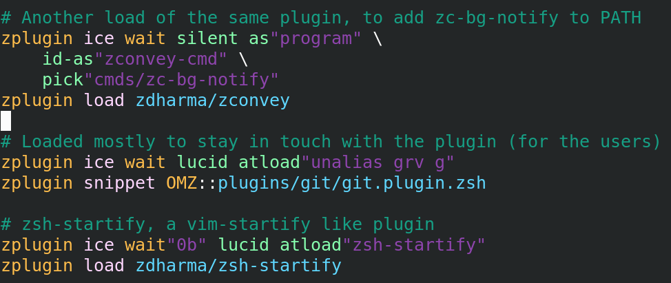
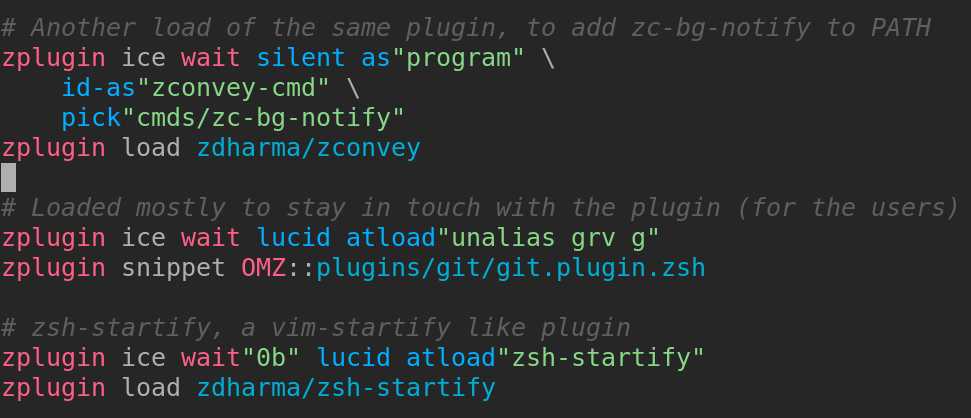
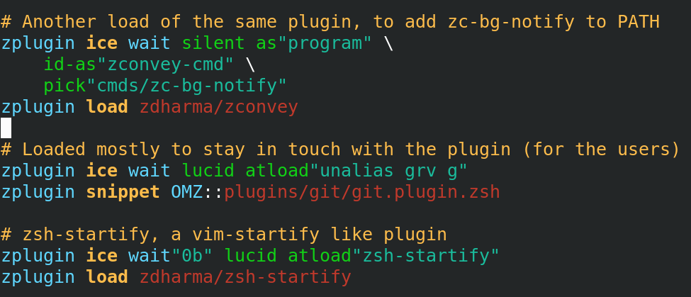
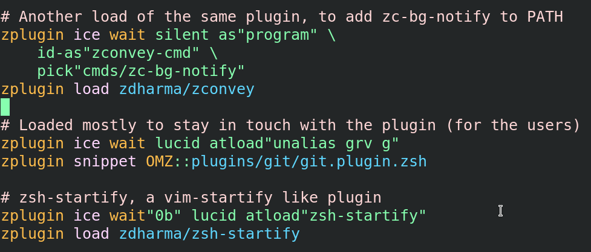
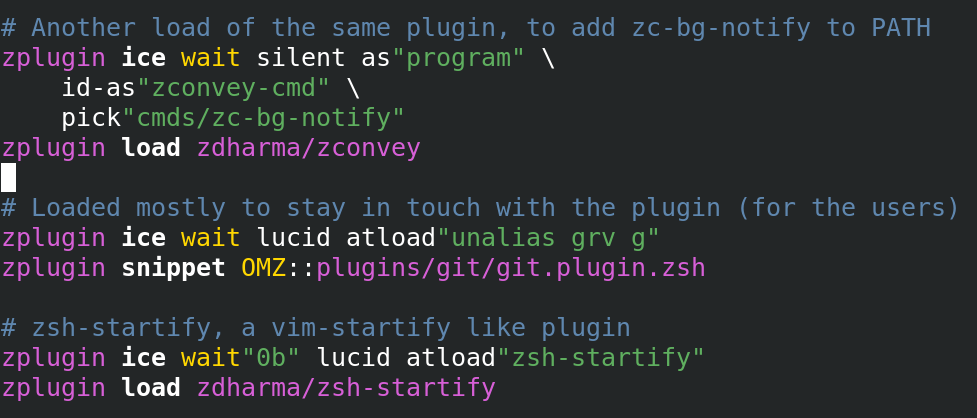

<h1 align="center">
  <p><a href="https://github.com/z-shell/zi">
    
  </a> ❮ ZI ❯ Vim Syntax </p></h1>
<h2 align="center">
  <p> A Vim syntax definition for <a href="https://github.com/z-shell/zi">zi</a> commands in any file of type <code>zsh</code> </p>
</h2></div><hr />

# Installation

Load as a Vim plugin. E.g. when using [vim-plug](https://github.com/junegunn/vim-plug), add to `~/.vimrc`:

```vim
Plug 'z-shell/zi-vim-syntax'
```

and then issue the `:PlugInstall` command.

## Manual Installation

To install the syntax copy the file `after/syntax/zsh.vim` under the path `~/.vim/syntax/after`.

### Examples

The default theme:



The theme `flrnprz/plastic.vim`:



The theme `slate`:



The theme `murphy`:



The theme `lucasprag/simpleblack`:



### TODO

1. Highlight user and plugin with different colors.
2. Make the `wait`'s distinctness controlled.
3. Make the syntax matching commands fully contained.
4. Fix bugs.
5. Other?
